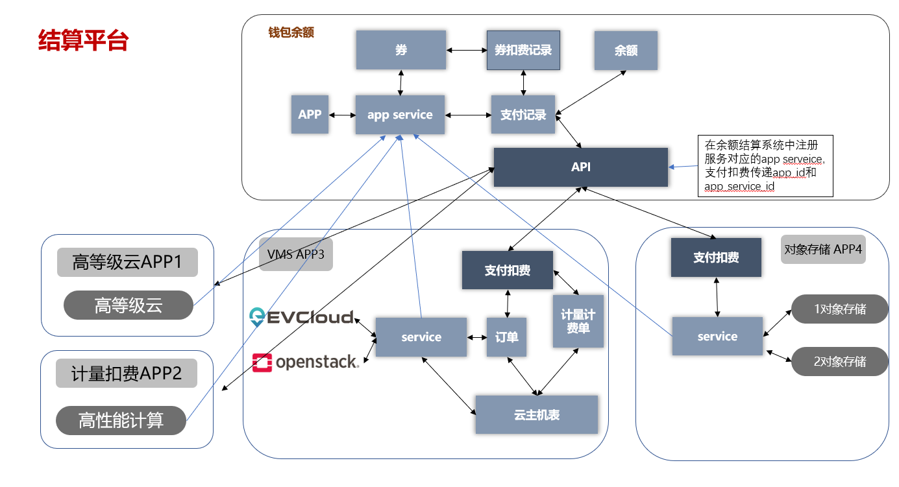

## 说明
以下文档中描述的接口均可在在线文档中“trade”部分查看，为避免此文档更新不及时造成困扰，或者如果遇到问题，可以查看
<a href="/apidocs/" target="_blank">在线API文档</a>。

## 1 接入余额结算准备条件
***
> 需要先注册APP，再注册app service，一个app下可以有多个app service，至少要有一个app service，
支付扣费交易时需要指定app service id；   
> app service可以理解为在app下进一步细分了一个层级，例如一个接入的app下有云主机和存储2种资源服务，结算的时候2种资源的订单费用
想分别结算，就可以分别注册一个app service 1和app service 2，不想分开结算就注册一个app service，支付交易记录会记录
app service id。   
> 余额结算系统有代金券，一个代金券绑定到一个app service，券的结算使用限制在对应的app service，在app下细分一
个app service层级，也是为了细分代金券的结算使用范围（有的券只能用于云主机资源订单费用抵扣，有的券只能用于存储资源订单费用抵扣）。   
> 余额结算系统每个app需要配置app接入者一方的RSA2048密钥对的公钥，用于双方的签名认证;
> app方需要拿到余额结算服务的RSA公钥，用于请求api时响应结果的验签。

> **app和app service的注册请联系技术支持人员。**

#### 加签和验签密钥对   
  加签和验签采用RSA加密算法，长度2048 bit，私钥编码方式为PEM，格式为PKCS#8不加密，
  公钥编码方式为PEM，格式为X.509 subject Public Key Info with PKCS#1，公钥指数（publicExponent）是固定值65537。     
  密钥对分为APP密钥对（用于API请求签名认证）和结算服务密钥对（用于api响应结果的验签）。     
  APP密钥对，APP方使用私钥生成签名，结算服务使用APP密钥的公钥进行验签。  
  结算服务密钥对，结算服务使用私钥对api的响应结果进行签名，api请求方可使用公钥进行验签。
  
  结算服务提供了一个生成RSA密钥对的接口，具体信息可以查看在线文档：  
  `POST / https://vms.cstcloud.cn/api/trade/rsakey/generate`

#### 结算服务示意图 


## 2 请求签名
***
> 加签认证用于部分安全性较高的接口，其他接口支持科技云通行证JWT认证方式。   
> 签名sign通过标头"Authorization"传递。   
`Authorization: 'SHA256-RSA2048 sign'`    
> 请求签名是客户端（应用）请求结算服务API时需要携带的身份/权限认证凭据，结算服务需要通过请求签名核实客户端的权限。
签名生成过程使用字符集UTF-8。

#### 请求签名生成规则
    待签名字符串(string_to_sign)的具体格式如下，无论各部分内容是否为空，各部分间的分割符“\n“不能缺少。
    ```
    认证类型\n                # SHA256-RSA2048    
    请求时间戳\n              # 1657097510; 请保持自身系统的时间准确   
    HTTP请求方法\n            # 大写字母, GET\POST\PUT    
    URI\n                    # api path, 不含域名； "/api/trade/test"   
    QueryString\n           # 按参数排序,各参数key=value以&分割拼接, UriEncode(key) + "=" + UriEncode(value)   
    请求报文主体body            # json字符串，或者为空   
    ```
#### QueryString
>剔除 sign（需要以url参数传递签名的API对应的的参数名）字段，然后将所有参数与其对应值按参数名排序（字母升序排序）后，
组合成 参数=参数值 的格式，并且把这些参数用 & 字符连接起来。   
>参数名和参数值都需要经过uri编码, 空格字符是保留字符，必须编码为“%20”，而不是“+”

#### 待签名字符串
待签名字符串各部分以换行符\n分割拼接，示例如下：   
1. 以此验签测试api为例 URI: /api/trade/test
2. api有3个query参数: param1=test param1 ; param2=参数2 ; param3=66
   QueryString: param1=test%20param1&param2=%E5%8F%82%E6%95%B02&param3=66
3. 请求报文主体body: {'a': 1, 'b': 'test', 'c': '测试'}
4. 最后得到的待签名字符串如下：
```
   SHA256-RSA2048\n
   1668677356\n
   POST\n
   /api/trade/test\n
   param1=test%20param1&param2=%E5%8F%82%E6%95%B02&param3=66\n
   {"a": 1, "b": "test", "c": "\u6d4b\u8bd5"}
```
#### 对签名字符串进行签名生成signature
    使用SHA256WithRSA签名函数用APP的私钥对待签名字符串进行签名，并进行 Base64 编码，得到签名字符串signature如下：   
    lXI3baDfR9hCHahi06HKZDC4L9iaq+r6VuwN
    ABHo4QvBSeqPLDHd9b4yKnaCyxXrPfL2xrAhEyM+vYYen/5v6L8KBqVP4fCO0fSTsJlsD5gOnzwQK
    WCoqylDa8ZtoQQ8i7ZdXvZ0zbnQ5iRy940H+M9FfCkvZ5xPtAM74Ffxn7zKkEKj/poPxvBJuIENEY
    QBPYbALbxYxg3OGSjDeezjhaBbFP3TWmUp52Tb4yPERgmfVLVhme+BYHauRjnPbsDApeLvjspIi1V
    JKIzXewhmw75w3y1MLW9hR4iZA/Yy/U+Fc4mZTgc354FHkjZukQMLEzyGeK5sO/tY/hrbwAO+PA==

#### 最终签名sign格式，以下4部分以分割符“,”拼接。
    认证类型,                # SHA256-RSA2048
    请求时间戳,              # 1668677356; 请保持自身系统的时间准确，时间戳误差1小时内有效
    app_id,                 # 20220615085208
    signature

    最后得到sign:
    SHA256-RSA2048,20221117092916,1668677356,lXI3baDfR9hCHahi06HKZDC4L9iaq+r6VuwN
    ABHo4QvBSeqPLDHd9b4yKnaCyxXrPfL2xrAhEyM+vYYen/5v6L8KBqVP4fCO0fSTsJlsD5gOnzwQK
    WCoqylDa8ZtoQQ8i7ZdXvZ0zbnQ5iRy940H+M9FfCkvZ5xPtAM74Ffxn7zKkEKj/poPxvBJuIENEY
    QBPYbALbxYxg3OGSjDeezjhaBbFP3TWmUp52Tb4yPERgmfVLVhme+BYHauRjnPbsDApeLvjspIi1V
    JKIzXewhmw75w3y1MLW9hR4iZA/Yy/U+Fc4mZTgc354FHkjZukQMLEzyGeK5sO/tY/hrbwAO+PA==

## 3 应答签名
***
> 客户端请求服务API，API响应会返回应答签名，用于客户端验签，验证api响应的真实性。

#### 应答签名通过3个标头header返回：
    标头 Pay-Sign-Type：SHA256-RSA2048     # 认证类型
    标头 Pay-Timestamp：1657184002         # 响应时间戳
    标头 Pay-Signature：                   # 应答签名

#### 应答签名字符串格式：
    认证类型\n              # 标头 Pay-Sign-Type
    应答时间戳\n             # 标头 Pay-Timestamp
    响应报文主体

#### 响应应答示例：
    标头 Pay-Sign-Type：SHA256-RSA2048     # 认证类型
    标头 Pay-Timestamp：1657184002         # 响应时间戳
    标头 Pay-Signature：                   # 应答签名
    UZz94tSxywv2ZfanJ/WURXmsnvM6yA8xoUfoddDQX7Rxw9b/HPWSdc1WdMZLSnfE9mAazETG1gj
    CdD9MfhJHR2tKF6hW4+qBVaoQ4bsnSHeDjGTgSNoXNbn8zuadxITGnDwHvrGgtrLMUi6iwDU4I4
    NYwRRzteVfJU71MsLbKwNtWpHok9hqljVI6tn7nFKUzHq+HImv6oKpSrBaVi1c5PW6PUDPrwjmO
    jxx876TrxKM7/3W0ztVF0ACEfAHPtXzPt4gP4AoRGeYtmWVypMK0xTlo2OeKTXej9GdUkdJWsRm
    /rcHtAYdOSHdF47hIuU+puKfuhg2WVUzLpwdJd4D+g==

    响应报文主体：{'a': 1, 'b': 'test', 'c': '测试'}

#### 验签
    应答签名字符串：
    ```
    SHA256-RSA2048\\n
    1657184002\\n
    {'a': 1, 'b': 'test', 'c': '测试'}
    ```
    使用SHA256WithRSA验签函数用 余额结算服务 的公钥对签名字符串进行签名验签。


## 4 加签验签测试接口
***

+ **说明**
>加签验签测试;   
> 签名sign通过标头"Authorization"传递。   
`Authorization: 'SHA256-RSA2048 sign'`

+ **请求url**
>https://vms.cstcloud.cn/api/trade/test

+ **请求方式**
>POST

***
+ **Query参数**   

可随意添加

| 参数 |   值   |
| :------: | :---: |
| param1 |  test param1  |
| param2 |  参数2   |
| param1 |  66   |

+ **请求体参数**

可随意添加

+ **请求示例**    
https://vms.cstcloud.cn/api/trade/test?param1=test%20param1&param2=%E5%8F%82%E6%95%B02&param3=66
```json
{
  "name1": "string",
  "name2": "string",
  "name3": "string"
}
```

+ **返回示例**  
响应标头  
```
Pay-Sign-Type：SHA256-RSA2048     # 认证类型
Pay-Timestamp：1657184002         # 响应时间戳
Pay-Signature：xxx                # 应答签名
```

请求成功时返回客户端请求体的内容   

```json
{
  "name1": "string",
  "name2": "string",
  "name3": "string"
}
```
请求错误响应示例    
```json
{
    "code": "xxx",
    "message": "xxx"
}
```
+ 错误码   

| 状态码 | 错误码 |             描述             | 解决方案 |
| :------: | :------: | :--------------------------: | :------: |
| 400  |  BadRequest   | 请求数据有误 | |
| 400  |  InvalidJWT   | Token is invalid or expired. | |
| 401  |  NoSuchAPPID   | app_id不存在 | |
| 401  |  AppStatusUnaudited   | 应用app处于未审核状态 | 联系服务技术支持人员 |
| 401  |  AppStatusBan   | 应用处于禁止状态 | 联系服务技术支持人员 |
| 401  |  NoSetPublicKey   | app未配置RSA公钥 | |
| 401  |  InvalidSignature   | 签名无效 | 检查签名生产过程是否有误，检查APP的私钥和RSA公钥是否匹配 |


## 5 支付扣费（JWT指定付款用户）
***

+ **说明**
> 向余额结算服务发起支付扣费，通过AAI/科技云通行证用户认证JWT指定付款用户。   
> 此接口适用要求：支持AAI/科技云通行证登录认证的APP，APP服务中扣费过程需要用户交互确认，即能拿到用户AAI/科技云通行证jwt。

+ **请求url**
>https://vms.cstcloud.cn/api/trade/charge/jwt

+ **请求方式**
>POST

***
+ **Query参数**
>无

+ **请求体参数**

| 参数 | 必选  | 参数类型 |   描述   |
| :------: | :---: | :------: | :------: |
| subject |  是   |  sring(255)   |   标题   |
| order_id |  是   |  sring(36)   |   外部订单ID，应用系统内部唯一   |
| amounts  |  是   |  sring(decial)   | 支付扣费金额，整数最大8位，小数点后2位，精确到0.01 |
| app_service_id  |  是   |  sring(36)   | APP服务ID |
| aai_jwt  |  是   |  sring   | AAI/科技云通行证用户认证JWT，用于指定付款用户，并验证付款用户的有效性 |
| remark  |  否   |  sring(255)   | 备注信息 |

***

+ **请求示例**    

```json
{
  "subject": "string",
  "order_id": "string",
  "amounts": "string",
  "app_service_id": "string",
  "aai_jwt": "string",
  "remark": "string"
}
```

+ **响应示例**

| 参数 | 参数类型 |             参数名             | 描述 |
| :------: | :------: | :--------------------------: | :------: |
| id  |  sring   | 支付记录编号 | |
| subject |   sring    | 标题 | |
| payment_method  |  sring   | 支付方式 | balance(余额支付)；coupon(代金券支付)；balance+coupon(余额+代金卷)           |
| executor |  sring   | 交易执行人，可忽略 | |
| payer_id |  sring  | 支付者id | |
| payer_name |  sring  | 支付者名称 | |
| payer_type |  sring  | 支付者类型 | user(支付者是用户)；vo(支付者是VO组) |
| payable_amounts | string | 应付金额 | 需要支付的、要扣除的金额， 例如 66.66 |
| amounts | string | 余额扣费金额 | 此次支付交易从余额账户扣除的金额， 例如 -66.66 |
| coupon_amount | string |  代金券扣费金额 | 此次支付交易从代金券扣费（抵扣）的金额， 例如 -66.66 |
| creation_time | string | 创建时间 | 接收扣费请求的时间 |
| payment_time | string | 支付成功完成时间 | |
| status | string | 支付状态 | wait：未支付；success：支付成功；error：支付失败；closed: 交易关闭（未支付时撤销了扣费） |
| status_desc | string | 支付状态描述 | 比如支付失败的原因 |
| remark | string | 备注 |  |
| order_id | string | 外部订单编号 |  |
| app_id | string | 应用id |  |
| app_service_id | string | 应用子服务id |  |
 
响应标头  
```
Pay-Sign-Type：SHA256-RSA2048     # 认证类型
Pay-Timestamp：1657184002         # 响应时间戳
Pay-Signature：xxx                # 应答签名
```

请求成功响应示例
```json
{
    "id": "202207190608088519002990",
    "subject": "云主机（订购）8个月",
    "payment_method": "balance",
    "executor": "",
    "payer_id": "28b94370-0729-11ed-8d9d-c8009fe2ebbc",
    "payer_name": "lilei@xx.com",
    "payer_type": "user",   
    "payable_amounts": "1.99",
    "amounts": "-1.99",       
    "coupon_amount": "0.00", 
    "creation_time": "2022-07-19T06:08:08.852251Z",
    "payment_time": "2022-07-19T06:08:08.852251Z",
    "status": "success",
    "status_desc": "支付成功",
    "remark": "test remark",
    "order_id": "123456789",
    "app_id": "20220719060807",
    "app_service_id": "123"
}
```
请求错误响应示例    
```json
{
    "code": "xxx",
    "message": "xxx"
}
```
错误码   

| 状态码 | 错误码 |             描述             | 解决方案 |
| :------: | :------: | :--------------------------: | :------: |
| 400  |  BadRequest   | 请求数据有误 | |
| 400  |  InvalidJWT   | Token is invalid or expired. | |
| 401  |  NoSuchAPPID   | app_id不存在 | |
| 401  |  AppStatusUnaudited   | 应用app处于未审核状态 | 联系服务技术支持人员 |
| 401  |  AppStatusBan   | 应用处于禁止状态 | 联系服务技术支持人员 |
| 401  |  NoSetPublicKey   | app未配置RSA公钥 | |
| 401  |  InvalidSignature   | 签名无效 | 检查签名生产过程是否有误，检查APP的私钥和RSA公钥是否匹配 |
| 409  |  BalanceNotEnough   | 余额不足 | |


## 6 支付扣费（直接指定用户名）
***

+ **说明**
> 此接口给予了APP最大的信任，直接通过用户名指定付款用户，向余额结算服务发起支付扣费。   
> 用于APP对应的服务内扣费过程中无用户参与，即无法拿到AAI/科技云通行证用户认证JWT的场景。

+ **请求url**
>https://vms.cstcloud.cn/api/trade/charge/account

+ **请求方式**
>POST

***
+ **Query参数**
>无

+ **请求体参数**

| 参数 | 必选  | 参数类型 |   描述   |
| :------: | :---: | :------: | :------: |
| subject |  是   |  sring(255)   |   标题   |
| order_id |  是   |  sring(36)   |   外部订单ID，应用系统内部唯一   |
| amounts  |  是   |  sring(decial)   | 支付扣费金额，整数最大8位，小数点后2位，精确到0.01 |
| app_service_id  |  是   |  sring(36)   | APP服务ID |
| username  |  是   |  sring(128)   | AAI/科技云通行证用户邮箱，用于指定付款用户 |
| remark  |  否   |  sring(255)   | 备注信息 |

***

+ **请求示例**    

```json
{
  "subject": "string",
  "order_id": "string",
  "amounts": "string",
  "app_service_id": "string",
  "username": "lilei@xx.com",
  "remark": "string"
}
```

+ **响应示例**

| 参数 | 参数类型 |             参数名             | 描述 |
| :------: | :------: | :--------------------------: | :------: |
| id  |  sring   | 支付记录编号 | |
| subject |   sring    | 标题 | |
| payment_method  |  sring   | 支付方式 | balance(余额支付)；coupon(代金券支付)；balance+coupon(余额+代金卷)           |
| executor |  sring   | 交易执行人 | 主要用于记录vo组扣费支付交易时的执行人 |
| payer_id |  sring  | 支付者id | |
| payer_name |  sring  | 支付者名称 | |
| payer_type |  sring  | 支付者类型 | user(支付者是用户)；vo(支付者是VO组) |
| payable_amounts | string | 应付金额 | 需要支付的、要扣除的金额， 例如 66.66 |
| amounts | string | 余额扣费金额 | 此次支付交易从余额账户扣除的金额， 例如 -66.66 |
| coupon_amount | string |  代金券扣费金额 | 此次支付交易从代金券扣费（抵扣）的金额， 例如 -66.66 |
| creation_time | string | 创建时间 | 接收扣费请求的时间 |
| payment_time | string | 支付成功完成时间 | |
| status | string | 支付状态 | wait：未支付；success：支付成功；error：支付失败；closed: 交易关闭（未支付时撤销了扣费） |
| status_desc | string | 支付状态描述 | 比如支付失败的原因 |
| remark | string | 备注 |  |
| order_id | string | 外部订单编号 |  |
| app_id | string | 应用id |  |
| app_service_id | string | 应用子服务id |  |
 
响应标头  
```
Pay-Sign-Type：SHA256-RSA2048     # 认证类型
Pay-Timestamp：1657184002         # 响应时间戳
Pay-Signature：xxx                # 应答签名
```

请求成功响应示例
```json
{
    "id": "202207190608088519002990",
    "subject": "云主机（订购）8个月",
    "payment_method": "balance",
    "executor": "",
    "payer_id": "28b94370-0729-11ed-8d9d-c8009fe2ebbc",
    "payer_name": "lilei@xx.com",
    "payer_type": "user",   
    "payable_amounts": "1.99",
    "amounts": "-1.99",       
    "coupon_amount": "0.00", 
    "creation_time": "2022-07-19T06:08:08.852251Z",
    "payment_time": "2022-07-19T06:08:08.852251Z",
    "status": "success",
    "status_desc": "支付成功",
    "remark": "test remark",
    "order_id": "123456789",
    "app_id": "20220719060807",
    "app_service_id": "123"
}
```
请求错误响应示例    
```json
{
    "code": "xxx",
    "message": "xxx"
}
```
错误码   

| 状态码 | 错误码 |             描述             | 解决方案 |
| :------: | :------: | :--------------------------: | :------: |
| 400  |  BadRequest   | 请求数据有误 | |
| 400  |  InvalidJWT   | Token is invalid or expired. | |
| 401  |  NoSuchAPPID   | app_id不存在 | |
| 401  |  AppStatusUnaudited   | 应用app处于未审核状态 | 联系服务技术支持人员 |
| 401  |  AppStatusBan   | 应用处于禁止状态 | 联系服务技术支持人员 |
| 401  |  NoSetPublicKey   | app未配置RSA公钥 | |
| 401  |  InvalidSignature   | 签名无效 | 检查签名生产过程是否有误，检查APP的私钥和RSA公钥是否匹配 |
| 404  |  NoSuchBalanceAccount   | 指定的付费用户不存在（余额不足） | 付款用户名有误，或者可能未登录过结算系统（没有余额账号） |
| 409  |  BalanceNotEnough   | 余额不足 | |


## 7 支付交易记录编号查询支付交易记录
***

+ **说明**
> 支付交易记录编号查询支付交易记录

+ **请求url**
>https://vms.cstcloud.cn/api/trade/query/trade/{trade_id}

+ **请求方式**
>GET

+ **Path参数**

| 参数 | 必选  | 参数类型 |   描述   |
| :------: | :---: | :------: | :------: |
| trade_id |  是   |  sring   |   结算服务支付/交易记录编号(id)   |

***
+ **Query参数**
>无

+ **请求体参数**
>无   

***

+ **请求示例**   
```
https://vms.cstcloud.cn/api/trade/query/trade/202207190608088519002990
```

+ **响应示例**

| 参数 | 参数类型 |             参数名             | 描述 |
| :------: | :------: | :--------------------------: | :------: |
| id  |  sring   | 支付记录编号 | |
| subject |   sring    | 标题 | |
| payment_method  |  sring   | 支付方式 | balance(余额支付)；coupon(代金券支付)；balance+coupon(余额+代金卷)           |
| executor |  sring   | 交易执行人，可忽略 | |
| payer_id |  sring  | 支付者id | |
| payer_name |  sring  | 支付者名程 | |
| payer_type |  sring  | 支付者类型 | user(支付者是用户)；vo(支付者是VO组) |
| payable_amounts | string | 应付金额 | 需要支付的、要扣除的金额， 例如 66.66 |
| amounts | string | 余额扣费金额 | 例如 -66.66|
| coupon_amount | string |  代金券扣费金额 | 例如 -88.00 |
| creation_time | string | 创建时间 | 接收扣费请求的时间 |
| payment_time | string | 支付成功完成时间 | |
| status | string | 支付状态 | wait：未支付；success：支付成功；error：支付失败；closed: 交易关闭（未支付时撤销了扣费） |
| status_desc | string | 支付状态描述 | 比如支付失败的原因 |
| remark | string | 备注 |  |
| order_id | string | 外部订单编号 |  |
| app_id | string | 应用id |  |
| app_service_id | string | 应用子服务id |  |
 
响应标头  
```
Pay-Sign-Type：SHA256-RSA2048     # 认证类型
Pay-Timestamp：1657184002         # 响应时间戳
Pay-Signature：xxx                # 应答签名
```

请求成功响应示例
```json
{
    "id": "202207190608088519002990",
    "subject": "云主机（订购）8个月",
    "payment_method": "balance",
    "executor": "",
    "payer_id": "28b94370-0729-11ed-8d9d-c8009fe2ebbc",
    "payer_name": "lilei@xx.com",
    "payer_type": "user",   
    "payable_amounts": "1.99",
    "amounts": "-1.99",       
    "coupon_amount": "0.00", 
    "creation_time": "2022-07-19T06:08:08.852251Z",
    "payment_time": "2022-07-19T06:08:08.852251Z",
    "status": "success",
    "status_desc": "支付成功",
    "remark": "test remark",
    "order_id": "123456789",
    "app_id": "20220719060807",
    "app_service_id": "123"
}
```
请求错误响应示例    
```json
{
    "code": "xxx",
    "message": "xxx"
}
```
错误码   

| 状态码 | 错误码 |             描述             | 解决方案 |
| :------: | :------: | :--------------------------: | :------: |
| 400  |  BadRequest   | 请求数据有误 | |
| 401  |  NoSuchAPPID   | app_id不存在 | |
| 401  |  AppStatusUnaudited   | 应用app处于未审核状态 | 联系服务技术支持人员 |
| 401  |  AppStatusBan   | 应用处于禁止状态 | 联系服务技术支持人员 |
| 401  |  NoSetPublicKey   | app未配置RSA公钥 | |
| 401  |  InvalidSignature   | 签名无效 | 检查签名生产过程是否有误，检查APP的私钥和RSA公钥是否匹配 |
| 404  |  NoSuchTrade   | 查询的交易记录不存在 | |
| 404  |  NotOwnTrade   | 交易记录存在，但交易记录不属于你app | |


## 8 外部订单编号查询支付交易记录
***

+ **说明**
> 订单编号查询支付交易记录，可用于查询确认订单对应的支付/扣费是否成功或完成。

+ **请求url**
> https://vms.cstcloud.cn/api/trade/query/out-order/{order_id}

+ **请求方式**
>GET

+ **Path参数**

| 参数 | 必选  | 参数类型 |   描述   |
| :------: | :---: | :------: | :------: |
| order_id |  是   |  sring   |   应用APP内的订单编号   |

***
+ **Query参数**
>无

+ **请求体参数**
>无   

***

+ **请求示例**   
```
https://vms.cstcloud.cn/api/trade/query/out-order/123456789
```

+ **响应示例**

| 参数 | 参数类型 |             参数名             | 描述 |
| :------: | :------: | :--------------------------: | :------: |
| id  |  sring   | 支付记录编号 | |
| subject |   sring    | 标题 | |
| payment_method  |  sring   | 支付方式 | balance(余额支付)；coupon(代金券支付)；balance+coupon(余额+代金卷)           |
| executor |  sring   | 交易执行人，可忽略 | |
| payer_id |  sring  | 支付者id | |
| payer_name |  sring  | 支付者名程 | |
| payer_type |  sring  | 支付者类型 | user(支付者是用户)；vo(支付者是VO组) |
| payable_amounts | string | 应付金额 | 需要支付的、要扣除的金额， 例如 66.66 |
| amounts | string | 余额扣费金额 | 例如 -66.66|
| coupon_amount | string |  代金券扣费金额 | 例如 -88.00 |
| creation_time | string | 创建时间 | 接收扣费请求的时间 |
| payment_time | string | 支付成功完成时间 | |
| status | string | 支付状态 | wait：未支付；success：支付成功；error：支付失败；closed: 交易关闭（未支付时撤销了扣费） |
| status_desc | string | 支付状态描述 | 比如支付失败的原因 |
| remark | string | 备注 |  |
| order_id | string | 外部订单编号 |  |
| app_id | string | 应用id |  |
| app_service_id | string | 应用子服务id |  |
 
响应标头  
```
Pay-Sign-Type：SHA256-RSA2048     # 认证类型
Pay-Timestamp：1657184002         # 响应时间戳
Pay-Signature：xxx                # 应答签名
```

请求成功响应示例
```json
{
    "id": "202207190608088519002990",
    "subject": "云主机（订购）8个月",
    "payment_method": "balance",
    "executor": "",
    "payer_id": "28b94370-0729-11ed-8d9d-c8009fe2ebbc",
    "payer_name": "lilei@xx.com",
    "payer_type": "user", 
    "payable_amounts": "1.99",
    "amounts": "-1.99",       
    "coupon_amount": "0.00", 
    "creation_time": "2022-07-19T06:08:08.852251Z",
    "payment_time": "2022-07-19T06:08:08.852251Z",
    "status": "success",
    "status_desc": "支付成功",
    "remark": "test remark",
    "order_id": "123456789",
    "app_id": "20220719060807",
    "app_service_id": "123"
}
```
请求错误响应示例    
```json
{
    "code": "xxx",
    "message": "xxx"
}
```
错误码   

| 状态码 | 错误码 |             描述             | 解决方案 |
| :------: | :------: | :--------------------------: | :------: |
| 400  |  BadRequest   | 请求数据有误 | |
| 401  |  NoSuchAPPID   | app_id不存在 | |
| 401  |  AppStatusUnaudited   | 应用app处于未审核状态 | 联系服务技术支持人员 |
| 401  |  AppStatusBan   | 应用处于禁止状态 | 联系服务技术支持人员 |
| 401  |  NoSetPublicKey   | app未配置RSA公钥 | |
| 401  |  InvalidSignature   | 签名无效 | 检查签名生产过程是否有误，检查APP的私钥和RSA公钥是否匹配 |
| 404  |  NoSuchTrade   | 查询的交易记录不存在 | |


## 9 退款申请
***

+ **说明**
> 对扣费订单发起一笔退款申请。   
> 退款支持单笔交易分多次退款，每笔退款需要提交原支付交易的外部订单号（或钱包交易id）和一个退款单号（唯一）。
> 申请退款总金额不能超过订单金额。

+ **请求url**
> https://vms.cstcloud.cn/api/trade/refund

+ **请求方式**
>POST

+ **Path参数**
>无

***
+ **Query参数**
>无

+ **请求体参数**

| 参数 | 必选  | 参数类型 | 最大长度 |   描述   |
| :------: | :---: | :------: | :------: | :------: |
| out_order_id |  否   |  sring | 36 |   原支付交易对应的应用APP内的订单编号，与钱包支付交易编号 trade_id 二选一  |  
| trade_id |  否   |  sring   | 36 |   钱包支付交易编号，与订单编号 out_order_id 二选一  | 
| refund_amounts |  是   |  sring  | 十位整数 |   申请退款金额，支持两位小数  |
| refund_reason | 是 | string | 255 | 退款原因 |
| out_refund_id | 是 | string | 64 | 应用APP内的退款编号，必须唯一 |
| remark | 否 | string | 255 | 备注信息 |

***

+ **请求示例**   
```
https://vms.cstcloud.cn/api/trade/refund
```

+ **响应示例**

| 参数 | 参数类型 |    最大长度  |       参数名             | 描述 |
| :------: | :------: | :--------------------------: | :------: | :------: |
| id  |  sring   | 36 | 钱包退款交易编号 | |
| trade_id |   sring  | 36 | 钱包支付交易记录编号 | |
| out_order_id  |  sring | 36 | 外部订单编号 | 原支付交易对应的订单号 |
| out_refund_id |  sring | 64  | 外部退款编号 | app内部的退款单号，app系统内部唯一|
| refund_reason | string | 255 | 退款原因 |  |
| total_amounts | string | 8位整数，2位小数 | 退款对应的交易订单总金额 | 例如 66.66 |
| refund_amounts | string | 8位整数，2位小数 | 申请退款金额 | 例如 66.66|
| real_refund | string | 8位整数，2位小数 | 实际退款金额 | 例如 56.66|
| coupon_refund | string| 8位整数，2位小数 |  代金券或者优惠抵扣金额，此金额不退 | 例如 10.00 |
| creation_time | string | | 创建时间 | 接收退款请求的时间 |
| success_time | string | | 退款成功时间 | |
| status | string | 16 | 退款状态 | wait：未退款；success：退款成功；error：退款失败；closed: 交易关闭（未退款时撤销了退款） |
| status_desc | string | 255 | 退款状态描述 | 比如退款失败的原因 |
| remark | string | 255 | 备注 |  |
| owner_id |  sring | 36 | 退款入账者ID | |
| owner_name |  sring | 255 | 退款入账者名 | |
| owner_type |  sring | 16 | 退款入账者类型 | user(用户)；vo(VO组) |
 
响应标头  
```
Pay-Sign-Type：SHA256-RSA2048     # 认证类型
Pay-Timestamp：1657184002         # 响应时间戳
Pay-Signature：xxx                # 应答签名
```

请求成功响应示例
```json
{
    "id": "202211170816462378919617",
    "trade_id": "202211234433555",
    "out_order_id": "osd111111333556",
    "out_refund_id": "sfhwofwfj219191",
    "refund_reason": "预付费云主机退订",
    "total_amounts": "66.66",
    "refund_amounts": "56.66",
    "real_refund": "46.66",
    "coupon_refund": "10.00",
    "creation_time": "2022-11-17T08:16:46.237777Z",
    "success_time": "2022-11-17T08:16:46.237784Z",
    "status": "success",
    "status_desc": "退款成功",
    "remark": "备注",
    "owner_id": "48779638-bc67-11ec-873e-c8009fe2eb10",
    "owner_name": "lilei@cnic.cn",
    "owner_type": "user"
}
```
请求错误响应示例    
```json
{
    "code": "xxx",
    "message": "xxx"
}
```
错误码   

| 状态码 | 错误码 |             描述             | 解决方案 |
| :------: | :------: | :--------------------------: | :------: |
| 400  |  BadRequest   | 请求数据有误 | |
| 400  |  InvalidRemark   | 备注信息无效，字符太长。 | |
| 400  |  InvalidRefundReason   | 退款原因无效，字符太长。 | |
| 400  |  InvalidRefundAmount   | 退款金额无效无效 | 大于0.01，整数部分最大8位，精确到小数点后2位 |
| 400  |  MissingTradeId   | 订单编号或者订单的交易编号必须提供一个 | |
| 401  |  NoSuchAPPID   | app_id不存在 | |
| 401  |  AppStatusUnaudited   | 应用app处于未审核状态 | 联系服务技术支持人员 |
| 401  |  AppStatusBan   | 应用处于禁止状态 | 联系服务技术支持人员 |
| 401  |  NoSetPublicKey   | app未配置RSA公钥 | |
| 401  |  InvalidSignature   | 签名无效 | 检查签名生产过程是否有误，检查APP的私钥和RSA公钥是否匹配 |
| 404  |  NoSuchTrade   | 查询的交易记录不存在 | |
| 404  |  NotOwnTrade   | 交易记录存在，但交易记录不属于你app | |
| 404  |  NoSuchOutOrderId   | 订单号交易记录不存在 | |
| 409  |  OutRefundIdExists   | 退款单号已存在 | 退款单号必须唯一 |
| 409  |  TradeStatusInvalid  | 非支付成功状态的交易订单无法退款 | 必须是交易成功的订单才可以退款 |
| 409  |  RefundAmountsExceedTotal   | 退款金额超过了原订单金额 | 一笔支付成功的订单可以有多笔退款，所有退款金额不得超过订单总金额 |


## 10 退款查询
***

+ **说明**
> 查询退款状态。

+ **请求url**
> https://vms.cstcloud.cn/api/trade/refund/query

+ **请求方式**
>GET

+ **Path参数**
>无

***
+ **Query参数**

| 参数 | 必选  | 参数类型 |   描述   |
| :------: | :---: | :------: | :------: |
| out_refund_id |  否   |  sring   |   应用APP内的退款编号，与钱包退款交易编号 refund_id 二选一  |  
| refund_id |  否   |  sring   |   钱包退款交易编号，与外部退款编号 out_refund_id 二选一，同时存在优先使用refund_id  |

+ **请求体参数**
> 无

***

+ **请求示例**   
```
https://vms.cstcloud.cn/api/trade/refund/query?refund_id=xxx
```

+ **响应示例**

| 参数 | 参数类型 |    最大长度  |       参数名             | 描述 |
| :------: | :------: | :--------------------------: | :------: | :------: |
| id  |  sring   | 36 | 钱包退款交易编号 | |
| trade_id |   sring  | 36 | 钱包支付交易记录编号 | |
| out_order_id  |  sring | 36 | 外部订单编号 | 原支付交易对应的订单号 |
| out_refund_id |  sring | 64  | 外部退款编号 | app内部的退款单号，app系统内部唯一|
| refund_reason | string | 255 | 退款原因 |  |
| total_amounts | string | 8位整数，2位小数 | 退款对应的交易订单总金额 | 例如 66.66 |
| refund_amounts | string | 8位整数，2位小数 | 申请退款金额 | 例如 66.66|
| real_refund | string | 8位整数，2位小数 | 实际退款金额 | 例如 56.66|
| coupon_refund | string| 8位整数，2位小数 |  代金券或者优惠抵扣金额，此金额不退 | 例如 10.00 |
| creation_time | string | | 创建时间 | 接收退款请求的时间 |
| success_time | string | | 退款成功时间 | |
| status | string | 16 | 退款状态 | wait：未退款；success：退款成功；error：退款失败；closed: 交易关闭（未退款时撤销了退款） |
| status_desc | string | 255 | 退款状态描述 | 比如退款失败的原因 |
| remark | string | 255 | 备注 |  |
| owner_id |  sring | 36 | 退款入账者ID | |
| owner_name |  sring | 255 | 退款入账者名 | |
| owner_type |  sring | 16 | 退款入账者类型 | user(用户)；vo(VO组) |
 
响应标头  
```
Pay-Sign-Type：SHA256-RSA2048     # 认证类型
Pay-Timestamp：1657184002         # 响应时间戳
Pay-Signature：xxx                # 应答签名
```

请求成功响应示例
```json
{
    "id": "202211170816462378919617",
    "trade_id": "202211234433555",
    "out_order_id": "osd111111333556",
    "out_refund_id": "sfhwofwfj219191",
    "refund_reason": "预付费云主机退订",
    "total_amounts": "66.66",
    "refund_amounts": "56.66",
    "real_refund": "46.66",
    "coupon_refund": "10.00",
    "creation_time": "2022-11-17T08:16:46.237777Z",
    "success_time": "2022-11-17T08:16:46.237784Z",
    "status": "success",
    "status_desc": "退款成功",
    "remark": "备注",
    "owner_id": "48779638-bc67-11ec-873e-c8009fe2eb10",
    "owner_name": "lilei@cnic.cn",
    "owner_type": "user"
}
```
请求错误响应示例    
```json
{
    "code": "xxx",
    "message": "xxx"
}
```

错误码   

| 状态码 | 错误码 |             描述             | 解决方案 |
| :------: | :------: | :--------------------------: | :------: |
| 400  |  BadRequest   | 请求数据有误 | |
| 401  |  NoSuchAPPID   | app_id不存在 | |
| 401  |  AppStatusUnaudited   | 应用app处于未审核状态 | 联系服务技术支持人员 |
| 401  |  AppStatusBan   | 应用处于禁止状态 | 联系服务技术支持人员 |
| 401  |  NoSetPublicKey   | app未配置RSA公钥 | |
| 401  |  InvalidSignature   | 签名无效 | 检查签名生产过程是否有误，检查APP的私钥和RSA公钥是否匹配 |
| 404  |  NoSuchTrade   | 查询的交易记录不存在 | |
| 404  |  NotOwnTrade   | 交易记录存在，但交易记录不属于你app | |
| 404  |  NoSuchOutRefundId   | 退款单号交易记录不存在 | |
